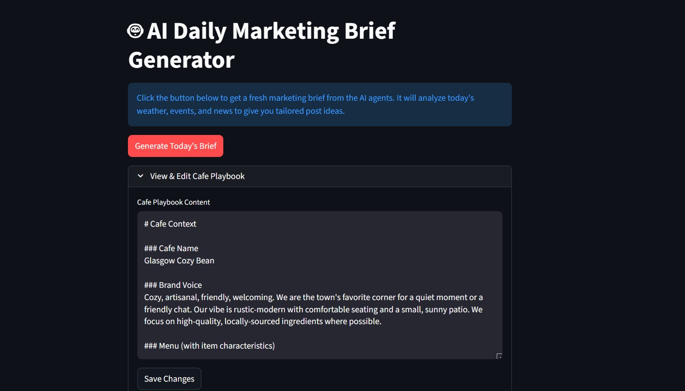
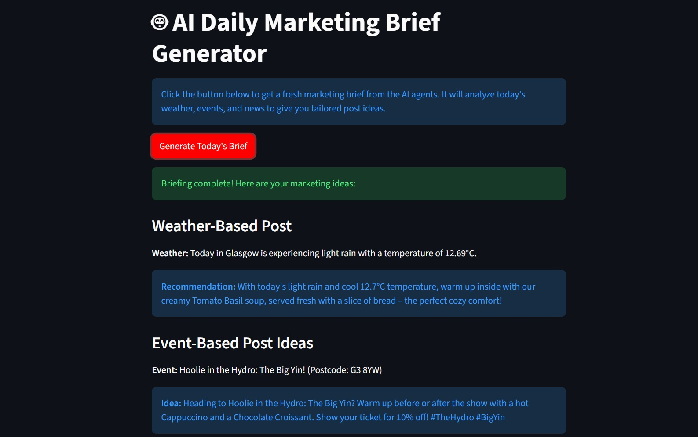
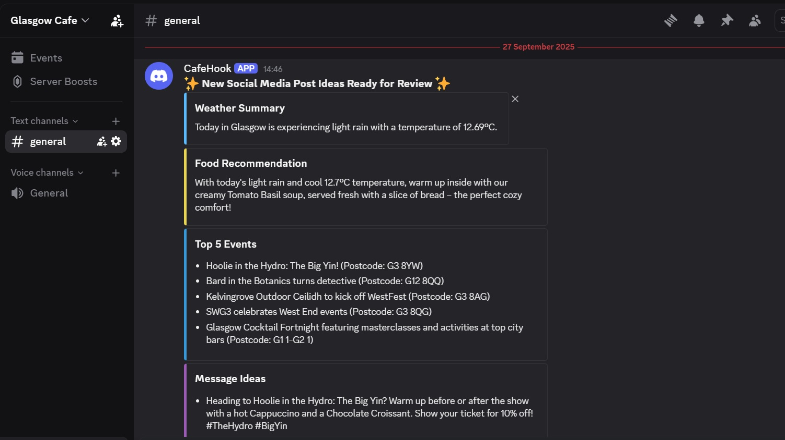

## AI Marketing Assistant for Small Business



-----
A **multi-agent AI application** that functions as an autonomous marketing assistant for small businesses, such as local cafes, tackling the daily challenge of creating timely, relevant, and on-brand social media content. Built with **LangGraph** and the **OpenAI API**, this system orchestrates a virtual marketing team of specialized AI agents to deliver a rich, actionable brief every day.

---
### The Three-Agent Workflow

The system transforms a complex, time-consuming creative task into a one-click process, delivering a set of customized and strategically aligned marketing ideas directly to the business owner.

#### 1. The 'Scout' Agent (Eyes & Ears)
* **Role**: Acts as the team's eyes and ears, scanning **real-time local data**.
* **Action**: Scans **weather forecasts**, news from **RSS feeds**, and multiple targeted **Google searches** for local events and conferences.
* **Output**: Compiles these findings into a concise brief of the day's key opportunities.

#### 2. The 'Strategist' Agent (The Brain)
* **Role**: The brain of the operation, providing strategic direction.
* **Action**: Analyzes the Scout's brief and cross-references it with an internal, **user-editable "Marketing Playbook."**
* **Output**: Formulates a high-level creative plan, deciding which opportunities to target and issuing specific instructions for the type of content to be created.

#### 3. The 'Creator' Agent (Execution)
* **Role**: Executes the strategic plan and assembles the final product.
* **Action**: Takes the Strategist's instructions and assembles the final, polished output.
* **Output**: A comprehensive **Daily Marketing Brief**, complete with:
    * One fully-formed post based on the day's **weather**.
    * Five distinct, **actionable post ideas** for the most relevant local events.
-----


-----
## Features

  * **Autonomous Opportunity Scouting**: Scans daily **weather forecasts**, **local news** via RSS, and multiple **Google Search** queries for relevant events to identify marketing "hooks."
  * **Strategic Content Generation**: Cross-references opportunities with a user-editable "**Marketing Playbook**" (`cafe_context.md`) to create strategically aligned content.
  * **Multi-Option Briefing**: Produces a **daily marketing brief** with multiple, ready-to-use post ideas: one tailored to the weather and several unique ideas for local events.
  * **Interactive UI & Live Playbook Editing**: The Streamlit interface allows the user to not only trigger the workflow and view results but also to live-edit the Marketing Playbook. Changes made in the UI are saved directly to the cafe_context.md file, empowering the user to instantly update the AI's strategy without touching any code.
  * **Automated Discord Notifications**: Sends the final, gracefully formatted brief directly to a **Discord channel** for easy review and approval.

-----


-----
## Tech Stack & Tools

### AI & Orchestration

| Tool | Description |
| :--- | :--- |
| **Python (3.9+)** | The core programming language for the application. |
| **LangGraph** | The primary framework for building the stateful, multi-agent workflow. |
| **LangChain** | Used for core components and integration with the language model. |
| **OpenAI API (GPT-4)** | Serves as the reasoning engine for all agentic tasks. |

### Frontend & UI

| Tool | Description |
| :--- | :--- |
| **Streamlit** | Used to create and serve the simple, interactive web interface. |

### Data & APIs

| Tool | Description |
| :--- | :--- |
| **SerpApi (Google Search)** | For performing real-time searches for local events and news. |
| **OpenWeatherMap API** | For fetching current local weather conditions. |
| **Feedparser** | A Python library for parsing local news RSS feeds. |

### Development & Deployment

| Tool | Description |
| :--- | :--- |
| **Python** | For managing an isolated project environment. |
| **Streamlit Community Cloud** | For deploying the application as a shareable web app. |
| **Git & GitHub** | For version control. |
| **Graphviz** | To generate a visual representation of the agent workflow. |

-----
## Prerequisites

You will need the following to run the project locally:

  * **Python 3.9** or newer
  * **Git**
  * **Graphviz** (for generating the workflow diagram)
  * An **OpenAI API Key**
  * A **SerpApi API Key**
  * A **Weather API Key** (from OpenWeatherMap)
  * A **Discord Webhook URL**

-----
## Getting Started

Follow these instructions to get a local copy of the project up and running.

### 1\. Clone this repository

```bash
git clone https://github.com/Manuele-T/AI_Marketing_Agent
cd AI_Marketing_Agent
```

### 2\. Set up the Python Environment

Create and activate a virtual environment.

**On macOS / Linux:**

```bash
python3 -m venv venv
source venv/bin/activate
```

**On Windows:**

```bash
python -m venv venv
.\venv\Scripts\activate
```

Install the required dependencies:

```bash
pip install -r requirements.txt
```

### 3\. Configure Your API Keys

Create a file named `.env` in the root of the project directory. Copy and paste the following, replacing the placeholder text with your actual keys and URL:

```env
OPENAI_API_KEY="your_openai_key_here"
WEATHER_API_KEY="your_weather_key_here"
SERP_API_KEY="your_serpapi_key_here"
DISCORD_WEBHOOK_URL="your_discord_webhook_url_here"
```

### 4\. Run the Streamlit Application

Use the Streamlit CLI to launch the web interface:

```bash
streamlit run ui.py
```

### 5\. Access the Application

Open your browser and navigate to the local URL provided by Streamlit, typically:

`http://localhost:8501`

-----
## Project Structure

```

├── src
│   ├── agents
│   │   ├── __init__.py
│   │   ├── creator.py
│   │   ├── scout.py
│   │   └── strategist.py
│   ├── core
│   │   ├── __init__.py
│   │   ├── graph.py
│   │   └── state.py
│   ├── tools
│   │   ├── __init__.py
│   │   ├── notifier.py
│   │   └── tools.py
│   ├── __init__.py
│   └── app.py
├── cafe_context.md
├── README.md
├── requirements.txt
└── ui.py
```
